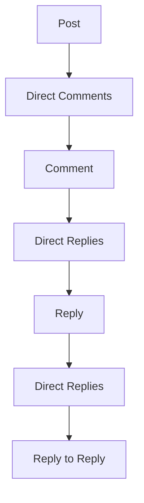
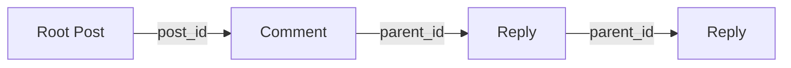

# Social Content Architecture

*Reference doc — describes how the system actually works, written from the implemented code. For the migration history, decisions, and open questions, see `docs/socials/social-content-migration-inspection.md` in this same directory.*

---

## 1. Overview

Posts, comments, and replies used to be three separate frontend representations (`Post`, `Comment`, and a third shape — `UserReplyItem` — just for the profile Replies tab), stitched together with a `pkid`/`id` dual identity and a two-kind repost model. All of that is now one canonical type: **`SocialContent`**.

An object's role is never inferred structurally (no more "does it have a `parent_comment` field" guessing). It's stated directly:

- `kind` — `"post" | "comment" | "reply"`
- `post_id` — which conversation (root post) this belongs to
- `parent_id` — its immediate parent, if any

This is deliberately closer to X/Twitter's conversation model: a reply can itself be replied to, at any depth, without the frontend needing a different type or a different code path at each level.

## 2. Core Mental Model

| Object | `kind` | `post_id` | `parent_id` |
|---|---|---|---|
| Post | `post` | `null` | `null` |
| Top-level comment | `comment` | root post's `id` | `null` |
| Reply | `reply` | root post's `id` | direct parent's `id` |

- **`kind`** — the object's role. Determines which UI affordances apply (a post can be pinned; a comment/reply cannot) and which endpoint to call for edit/delete.
- **`post_id`** — the root conversation. Every object below the post carries this, no matter how deep — it's how you know which post's thread you're in without walking the parent chain.
- **`parent_id`** — the immediate parent only. **Never the root post** for anything below a top-level comment. A reply three levels deep still has `post_id` pointing at the original post, but `parent_id` pointing at the reply directly above it.

`post_id !== parent_id` for any reply beyond the first level. This is the single most important invariant in the whole model — see §7.

## 3. Conversation Tree

```
Post A
├── Comment B
│   ├── Reply C
│   │   └── Reply D
│   └── Reply E
└── Comment F
```

```
A: kind=post,    post_id=null, parent_id=null
B: kind=comment, post_id=A,    parent_id=null
C: kind=reply,   post_id=A,    parent_id=B
D: kind=reply,   post_id=A,    parent_id=C
E: kind=reply,   post_id=A,    parent_id=B
F: kind=comment, post_id=A,    parent_id=null
```

Use this as the reference example when debugging a broken thread relationship — see §17.

## 4. Why This Is Not Recursive Data

The backend does not return a post with every comment and every reply embedded in one response. Instead:

```
Post
  ↓ GET /socials/post/comment/list/{post_uuid}
Direct comments
  ↓ GET /socials/post/comments/{comment_uuid}/replies
Direct replies
  ↓ (same endpoint, called with the reply's own id)
Direct replies of that reply
  ↓ ...continues at any depth
```

Each level is fetched separately, on demand, as a paginated list of **direct children only**. This is what makes arbitrarily deep conversations possible without an arbitrarily large response: the payload size at any point in the tree is bounded by one page of direct children, not by total thread size.

## 5. Read Architecture

| Endpoint (via Next.js proxy) | Returns | Used by |
|---|---|---|
| `GET /api/socials/post/[id]` → `/socials/post/{id}/get` | single `SocialContent` (post) | `usePostDetail` |
| `GET /api/socials/comment/[id]` → `/socials/post/comments/{id}` | single `SocialContent` (comment or reply) | `useContentDetail` |
| `GET /api/socials/post-comments/[id]` → `/socials/post/comment/list/{id}` | paginated `SocialContent[]` — direct comments of a post | `usePostComments` |
| `GET /api/socials/comment-replies/[id]` → `/socials/post/comments/{id}/replies` | paginated `SocialContent[]` — direct replies of a comment/reply | `useContentReplies` |
| `GET /api/socials/for-you-feed`, `following-feed`, `bookmarks`, `search`, `user-handle/[id]/*` | paginated `SocialContent[]` | `useFeed`, profile tab hooks |

Note there are genuinely two different backend endpoints for "get direct children" depending on whether the parent is a post or a comment/reply (`usePostComments` vs. `useContentReplies`). The frontend doesn't pretend these are one call — but it does give both the same **cache identity** (see §8), so from React Query's point of view a post's comments and a comment's replies are the same *kind* of thing, fetched two different ways.

## 6. Write Architecture

```
Create post:    { content, medial_urls, hashtags?, location?, who_can_see, who_can_reply }
Create comment: { post_id, content, medial_urls?, hashtags?, location? }
Create reply:   { parent_id, content, medial_urls?, hashtags?, location? }
Edit (any kind): { content?, medial_urls?, hashtags?, location? }
```

A reply's create payload never includes `post_id` — the server derives the root post from `parent_id`. This is why the frontend never needs to independently track "what post am I ultimately replying to" when composing a reply; it only needs to know the direct parent.

`id`, `kind`, `post_id`, and `parent_id` are never sent on an edit — they're immutable once created.

## 7. Relationship Invariants

These are hard rules, not conventions:

1. A post: `post_id = null`, `parent_id = null`.
2. A top-level comment: `post_id` = root post, `parent_id = null`.
3. A reply: `post_id` = root post, `parent_id` = direct parent.
4. A reply's `post_id` always matches its parent's `post_id` — same conversation, all the way down.
5. `parent_id` never means "root post."
6. Relationship fields are immutable through edits.
7. The client never derives a reply's parent from array position or list order — only from `reply.parent_id` itself.
8. A reply can itself be the parent of another reply. Nothing in the frontend caps depth.
9. `metrics.replies` counts **direct children only** — see §12.

## 8. React Query / Client Cache Model

Two key families, defined in `hooks/use-post-detail.ts`:

```ts
contentDetailKeys.detail(id)     // any single SocialContent — post, comment, or reply
contentChildrenKeys.direct(parentId)  // direct children of any id
```

Both `usePostDetail`/`useContentDetail` write into `contentDetailKeys` — one identity namespace regardless of which endpoint populated it. Both `usePostComments`/`useContentReplies` write into `contentChildrenKeys` — same shape, so `contentChildrenKeys.direct(postA.id)` (top-level comments) and `contentChildrenKeys.direct(commentB.id)` (B's replies) are just two entries in the same key family, not two different systems.

**Engagement patching** (`lib/content-engagement.ts`) is a single module, not split by kind:

- `findEngagementEntityAnywhere(qc, id)` — checks feeds, then any open detail query, then any open children list, in that order.
- `patchEngagementEverywhere(qc, id, patch)` — applies a patch to every occurrence of `id` across all three.
- `applyContentPatch(base, patch)` — the actual merge logic. Because `metrics`/`viewer`/`flags`/`permissions` are nested objects (unlike the old flat `Post`/`Comment` fields), a naive `{...base, ...patch}` on `{metrics: {reposts: 5}}` would silently wipe out `likes`/`replies`/every other metric. `applyContentPatch` merges each nested object individually instead. Every mutation hook goes through this — there is no other patch path.

**Prepending new content** (`hooks/use-comment.ts`, `usePrependContent`) writes into `contentChildrenKeys.direct(parentId)` and bumps that parent's `metrics.replies` via `adjustReplyCount`. It works identically whether `parentId` is a post or a comment/reply — this is what makes reply-to-reply "just work" at the cache layer without special-casing depth.

**Invalidation on deletion**: the frontend does not attempt to replicate the backend's cascade-delete of descendants. It removes what it can see (the deleted node from its parent's children list, and evicts the deleted node's own `contentChildrenKeys`/`contentDetailKeys` entries) and relies on the backend for everything below that.

## 9. Creation Flow

```
Post:
  CreatePostModal → useCreatePost → optimistic prepend to feedKeys.forYou
    → onSuccess: invalidate feedKeys.forYou

Top-level comment:
  ContentComposer (target.kind === "post") / CommentModal
    → useAddComment({ post_id, content, ... })
    → onSuccess: usePrependContent()(post.id, newContent)
        → writes into contentChildrenKeys.direct(post.id)
        → bumps post's metrics.replies everywhere it's cached

Reply (to a comment OR to another reply):
  ReplyModal (parent = whatever's being replied to) /
  ContentComposer (target.kind !== "post", inside a focused thread)
    → useAddComment({ parent_id, content, ... })   // post_id is never sent
    → onSuccess: usePrependContent()(parent.id, newContent)
        → writes into contentChildrenKeys.direct(parent.id) — the DIRECT
          parent's list, which may itself be a reply several levels deep
        → bumps the direct parent's metrics.replies, not any ancestor further up
```

The one rule this entire flow protects: the reply composer's `parent_id` always comes from the specific `SocialContent` node currently being replied to (`ReplyModal`'s `parent` prop, or `ContentComposer`'s `target` prop) — never a cached root-comment id, never assumed from context.

## 10. Edit Flow

```
existing content → PATCH { content?, medial_urls?, hashtags?, location? } → relationship unchanged
```

`useUpdatePost` (posts) patches the response directly into both `contentDetailKeys.detail(id)` and every feed cache via `patchEngagementInFeeds`, since the response is already a full `SocialContent` — no separate response-shape mapping is needed.

Comment/reply edit (`socialApi.editComment`, wired to `app/api/socials/comment/[id]` PATCH) exists at the API layer but has no call site wired into the UI yet — it's new capability added during this migration, not something the pre-existing UI used. See the migration doc's open items.

## 11. Delete Flow

```
Delete post → cascades to all descendant comments/replies (backend)
Delete comment/reply → cascades to descendant replies (backend)
```

The frontend's responsibility on delete: remove the deleted node from its parent's `contentChildrenKeys` list, evict the deleted node's own `contentDetailKeys`/`contentChildrenKeys` entries, and — if the deleted post was itself a repost — roll back the reposted-count and `my_repost_id` on the original (`useDeletePost`'s `originalPost` param). It does not walk and remove a full descendant tree client-side; that's the backend's job via cascade.

Comment/reply delete (`socialApi.deleteComment`) exists at the API layer, same status as edit above — added, not yet wired into a UI affordance.

## 12. Metrics Semantics

`metrics.replies` is **direct children only**, never a total descendant count.

```
A
├── B
│   ├── C
│   └── D
└── E
```

`A.metrics.replies = 2` (B and E). `B.metrics.replies = 2` (C and D). `C.metrics.replies = 0`. This is the same semantic the pre-migration `Comment.replies_count` already had — low risk in the migration, but worth stating explicitly since it's a common source of "why does this count look wrong" confusion.

## 13. Repost Model

```
Normal content:  original = null
Repost:          original = SocialContent   (the reposted thing, in full)
                 original.original === null, always — no recursive repost chains
```

`original.kind` can be `"post"`, `"comment"`, or `"reply"` — reposting isn't post-only. `lib/post-helpers.ts`'s `isBareRepost(content)` checks whether a repost has no quote text (a "bare" repost, vs. a quote-repost with commentary); `resolveEngagementContent(content)` resolves a bare repost to the entity that should actually drive its like/reply/repost counts and buttons — the original, not the wrapping repost. Both work identically regardless of `original.kind`.

`my_repost_id` (not part of the read contract's `viewer` object, carried forward from the pre-migration `my_repost_pkid`) points at *my own* repost of a piece of content, so "Undo repost" knows what to delete. While a repost mutation is in flight, it's temporarily set to a sentinel (`PENDING_REPOST_ID_PREFIX`-prefixed string) rather than a real id, so "undo" can't fire against something the server hasn't confirmed yet (`isSettledRepostId` guards this).

## 14. Permissions

```
Post: defines its own visibility/reply_policy
Comment/Reply: inherits the root post's policy (server-side)
```

The frontend never reconstructs this inheritance — it reads `permissions.can_view`/`permissions.can_reply` directly off whatever `SocialContent` it has, at any kind. `lib/post-permissions.ts`'s `canReplyTo(content)` works uniformly for a post, comment, or reply.

Deletion is not gated on `permissions.can_view` — that's a read-visibility check, not an ownership check. The delete UI in `PostOptionsMenu` gates on `content.user.pkid === currentUserId`, independent of visibility.

## 15. Legacy Compatibility

The backend may still accept old field names (`content_text`, `message`, `media_urls`, `post`, `parent_comment`) during its own transition. **No frontend code sends or reads any of them** — confirmed by repo-wide grep as part of this migration's validation. If you see one of these names anywhere in new code, that's a regression, not a compatibility shim that was intentionally kept.

## 16. Common Bugs & Anti-Patterns

| Bug | Check |
|---|---|
| Reply appears under the wrong parent | `reply.parent_id` — and the composer's bound target at the moment of submit (`ReplyModal`'s `parent` prop / `ContentComposer`'s `target` prop) |
| Reply appears in the wrong post's thread | `reply.post_id` vs. `parent.post_id` — must match |
| Nested reply becomes a top-level comment | `parent_id === null` on the created object — the composer sent `post_id` instead of `parent_id` |
| Reply count looks too high | Something is counting descendants instead of direct children — `metrics.replies` is direct-only |
| Reposted reply renders as if it were a post | Check `original.kind`, don't assume `"post"` |
| Repost renders recursively | `original.original` must be `null` — if it isn't, something upstream built a repost-of-a-repost incorrectly |
| Deleted content's replies still visible | `contentChildrenKeys.direct(deletedId)` wasn't evicted, or the parent's children list wasn't patched to remove the deleted entry |
| A like/bookmark updates the wrong card | Check `findEngagementEntityAnywhere` actually found the right entity — likely a stale `id` from before an optimistic swap |
| Engagement patch wipes out unrelated counts | The patch bypassed `applyContentPatch` and did a shallow `{...content, metrics: {...}}` merge directly — see §8 |

## 17. Debugging Checklist

For any broken content object:

```
[ ] id
[ ] kind
[ ] post_id
[ ] parent_id
[ ] metrics.replies
[ ] permissions
[ ] original / original.kind / original.original
[ ] which query produced it (contentDetailKeys vs contentChildrenKeys vs a feed key)
[ ] which mutation last touched it, and whether it went through applyContentPatch
```

For a broken reply relationship specifically:

```
[ ] Is kind === "reply"?
[ ] Does parent_id point at an object that actually exists?
[ ] Does that parent have the same post_id?
[ ] Is the reply being rendered from contentChildrenKeys.direct(parent_id) — the correct direct-child query — and not some other cached list?
```

## 18. Frontend Architecture Diagram





The left diagram is *loading order* (each level fetched on demand). The right diagram is the *relationship structure* (every node's `post_id` points straight at A, regardless of depth; only `parent_id` chains step by step).

## 19. Example End-to-End Conversation

Using the tree from §3:

1. **Load Post A** — `usePostDetail(A.id)` → `contentDetailKeys.detail(A.id)`.
2. **Load its comments** — `usePostComments(A.id)` → `contentChildrenKeys.direct(A.id)` → returns `[B, F]`.
3. **User opens Comment B** — `PostDetailView` pushes `B` onto `focusStack`. `ThreadFocusPanel` fetches `useContentDetail(B.id)` (B's own header) and `useContentReplies(B.id)` → `contentChildrenKeys.direct(B.id)` → returns `[C, E]`.
4. **User replies to C** (not B) — opens `ReplyModal` with `parent={C}`. Submission sends `{ parent_id: C.id, content: "..." }`. On success, `usePrependContent()(C.id, newReply)` writes the new reply into `contentChildrenKeys.direct(C.id)` and bumps `C.metrics.replies` — not B's, not A's.
5. **User opens C** — pushes `C` onto `focusStack` (now `[B, C]`). Fetches `useContentReplies(C.id)` → returns `[D, newReply]`.
6. **Someone deletes B** — backend cascades C, D, E, and the new reply. Frontend removes B from `contentChildrenKeys.direct(A.id)`, evicts `contentChildrenKeys.direct(B.id)` and `contentDetailKeys.detail(B.id)`. If the user was mid-thread inside B when this happens, `usePostDetail`/`useContentDetail` for the now-deleted nodes will simply fail to resolve on next fetch — there's no attempt to keep stale descendant data alive.

## 20. Architectural Decision

The frontend represents Posts, Comments, and Replies as a unified `SocialContent` model. Object role is determined by `kind`, conversation membership by `post_id`, and immediate hierarchy by `parent_id`. Descendants are loaded through paginated direct-child queries (`contentChildrenKeys`) rather than recursive API responses, and presented through a focused-thread UI (`ThreadFocusPanel` + a `focusStack`) that lets a conversation go arbitrarily deep without either an unbounded payload or an infinitely-indented UI. This preserves a seamless conversation experience while keeping the underlying structural relationships explicit and easy to reason about when something breaks.
